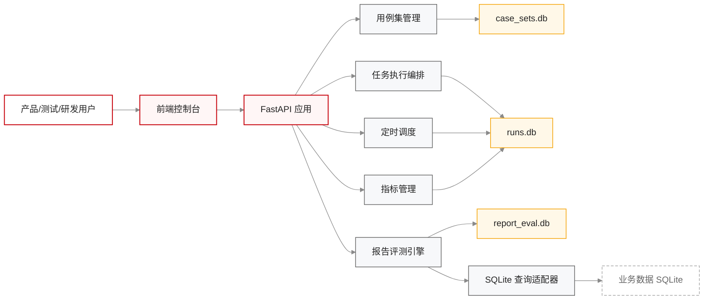
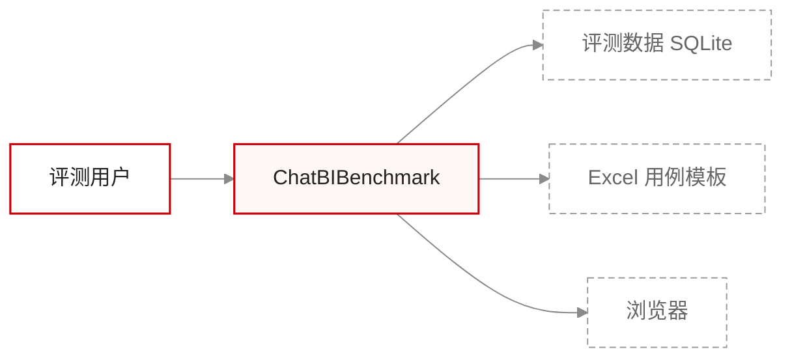
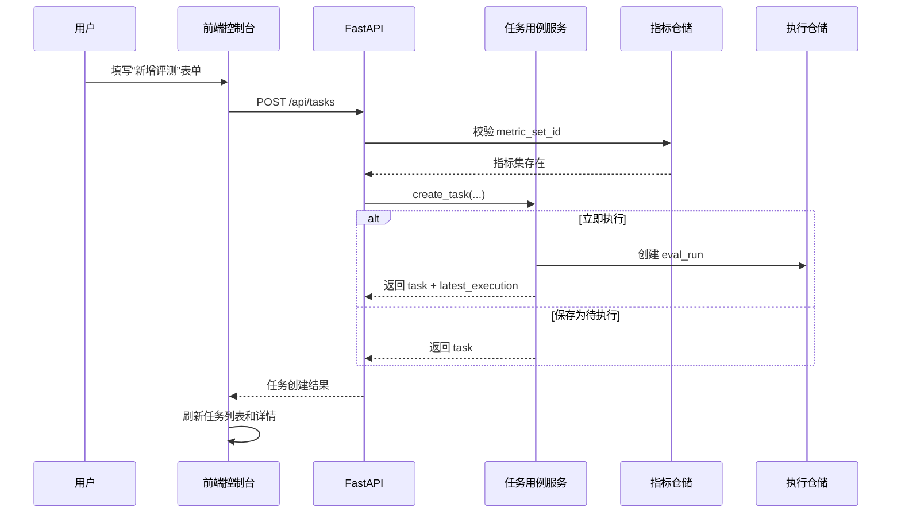
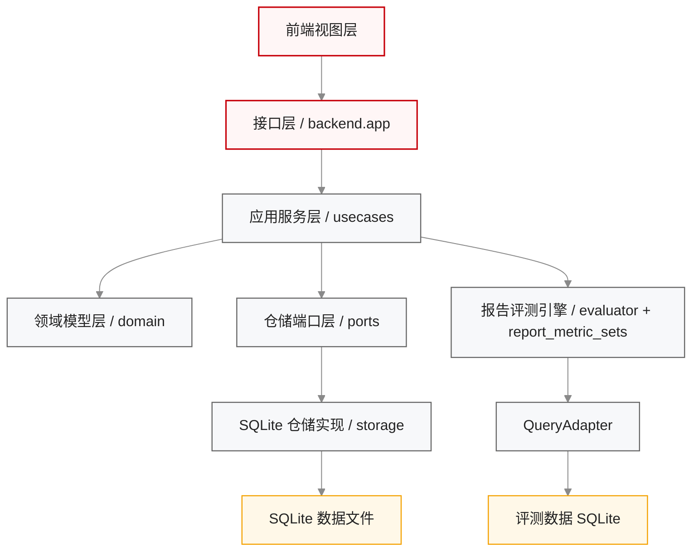
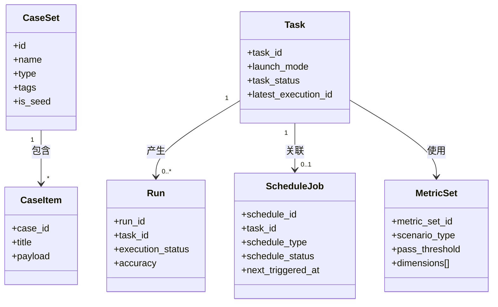
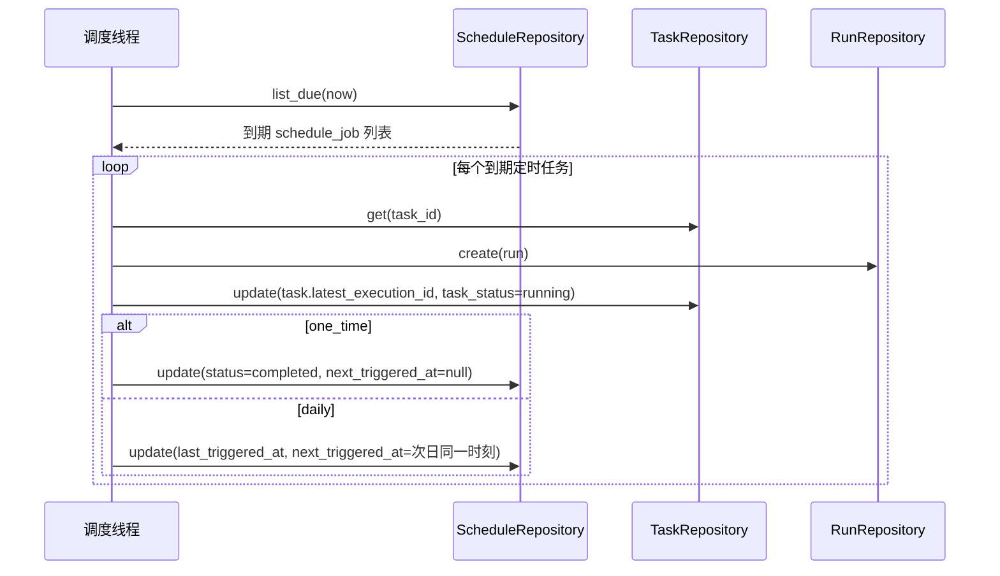
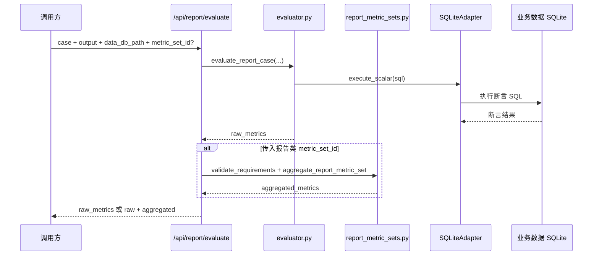
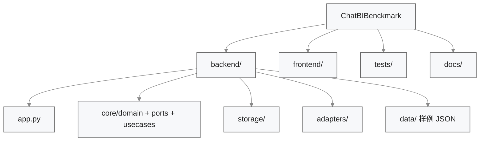
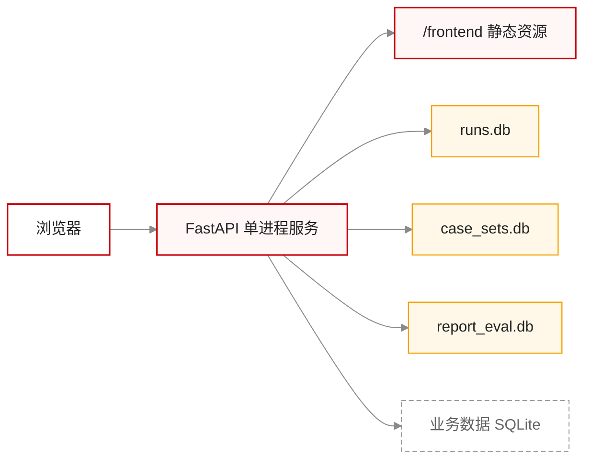

# ChatBIBenchmark 整体架构设计

## 1. 文档范围

本文档描述 ChatBIBenchmark 当前实现的整体架构，重点回答以下问题：

1. 系统对外提供哪些核心能力。
2. 各模块如何协作完成评测任务、定时执行、报告评测和用例集管理。
3. 当前工程代码如何分层组织、如何部署、如何持久化数据。

## 2. 系统定位

ChatBIBenchmark 是一个面向 ChatBI 场景的评测与管理平台，当前覆盖以下三类核心能力：

- 评测资产管理：管理用例集、用例、指标参数集。
- 评测运行编排：管理评测任务、执行记录、定时任务。
- 报告评测引擎：针对“报告多轮交互”场景执行结构化评测与指标聚合。

系统采用 `FastAPI + SQLite + Vanilla JS` 的单体架构形态，通过一个后端服务同时提供 API、静态前端和服务内轮询调度。

## 3. 模块划分

| 模块 | 主要职责 | 核心代码 |
| --- | --- | --- |
| 前端控制台 | 提供总览、任务列表、定时任务、用例集、指标管理等页面与交互 | `frontend/index.html` `frontend/app.js` |
| 后端应用装配 | 路由组织、对象装配、静态资源挂载、启动初始化 | `backend/app.py` |
| 用例集管理 | 用例集查询、详情、Excel 导入导出、种子用例集建模 | `backend/core/usecases/case_set_usecases.py` `backend/storage/case_set_repository.py` |
| 任务执行编排 | 评测任务创建、待执行/立即执行区分、执行记录管理 | `backend/core/usecases/task_usecases.py` `backend/storage/run_repository.py` |
| 定时调度 | 单次/每日调度、到期扫描、触发执行记录 | `backend/core/usecases/schedule_usecases.py` |
| 指标管理 | 指标集创建、更新、执行映射与生效状态管理 | `backend/core/usecases/metric_set_usecases.py` `backend/core/report_metric_sets.py` |
| 报告评测引擎 | 原始指标计算、维度映射、加权评分、run 汇总 | `backend/core/evaluator.py` `backend/core/report_metric_sets.py` |
| 持久化层 | 分别存储任务/调度/指标、用例集、报告评测结果 | `backend/storage/*.py` |

## 4. 模块协作关系

下图回答“系统各模块如何配合完成完整评测闭环”。

### 4.1 协作说明

1. 前端控制台负责页面切换、表单提交和结果展示，不承担业务计算。
2. 后端应用层负责将 HTTP 请求路由到具体用例服务，并完成 DTO 组装。
3. 用例集管理、任务执行编排、定时调度、指标管理、报告评测引擎共享同一个后端进程，但分别落在不同子模块与数据库文件中。
4. 报告评测引擎通过 `SQLiteAdapter` 执行断言 SQL，因此评分主依据是执行结果，而不是 SQL 文本。

## 5. 4+1 视图

### 5.1 用例视图

本视图回答“谁在使用系统、关键业务闭环是什么、系统边界在哪里”。

#### 5.1.1 角色与核心场景

| 角色 | 目标 | 主要入口 |
| --- | --- | --- |
| 测试/算法评测人员 | 导入用例集、创建评测任务、查看结果 | 用例集、任务列表、任务详情 |
| 平台维护人员 | 配置指标参数集、创建定时任务 | 指标管理、定时任务 |
| 报告评测设计人员 | 执行报告多轮交互评测，检查模板、参数、大纲和内容事实 | 报告评测 API、指标管理 |

#### 5.1.2 上下文图

#### 5.1.3 关键场景时序

### 5.2 逻辑视图

本视图回答“系统由哪些功能块组成、模块如何协作、依赖方向如何约束”。

#### 5.2.1 核心领域对象

### 5.3 过程视图

本视图回答“关键运行时流程如何发生、异步调度与评分聚合如何协作”。

#### 5.3.1 定时触发执行流程

#### 5.3.2 报告评测流程

### 5.4 开发视图

本视图回答“代码仓如何组织、哪些模块可以独立演进”。

### 5.5 物理视图

本视图回答“软件如何部署到节点、浏览器与本地数据库如何协作”。

## 6. 关键架构决策

| 决策 | 当前方案 | 原因 | 边界 |
| --- | --- | --- | --- |
| 单体部署 | 一个 FastAPI 进程同时承载 API、前端静态资源和定时调度 | 便于快速落地、部署简单 | 不适合多实例调度一致性场景 |
| 存储拆分 | 运行元数据、用例集、报告评测结果分别使用三个 SQLite 文件 | 降低不同模块表结构耦合 | 跨库事务与统一备份复杂 |
| 任务与执行分离 | `Task` 保存配置，`Run` 保存每次执行记录 | 支持待执行任务与多次执行历史 | 仍未接入真实执行器，仅记录运行元数据 |
| 报告评分以执行断言为主 | 内容评分通过 SQL 断言结果校验，不以文本相似度为主 | 更贴近业务正确性 | 当前仅支持 SQLite 数据源 |
| 指标分阶段接入 | 只有“报告多轮交互”指标集处于 active | 先把最复杂、最明确的场景打通 | 其它场景仍停留在配置层 |

## 7. [风险] 与后续设计关注点

- [风险] 定时调度为服务内线程，当前没有分布式锁与补偿执行能力。
- [风险] SQLite 文件路径仍为代码目录默认路径，跨机器部署时需要额外做数据目录和迁移策略。
- [风险] 环境配置、用例扩增工具尚未接入真实后端，前端页面和整体模块图中已按“占位能力”处理。
- [待确认] 后续若接入真实执行器，需要明确 `Task -> Runner -> Run` 的异步执行边界，以及任务状态回写方式。

## 8. 文档同步要求

整体架构文档必须在以下变化时同步更新：

1. 新增一级页面或后端子系统。
2. 任务、调度、报告评测、指标生效链路发生变化。
3. 存储拆分策略、部署形态、默认数据库路径发生变化。
