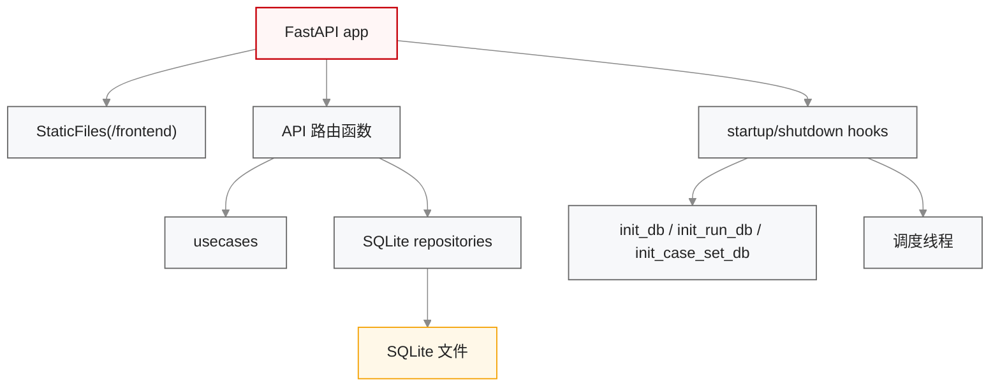
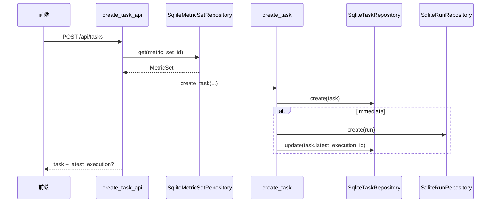
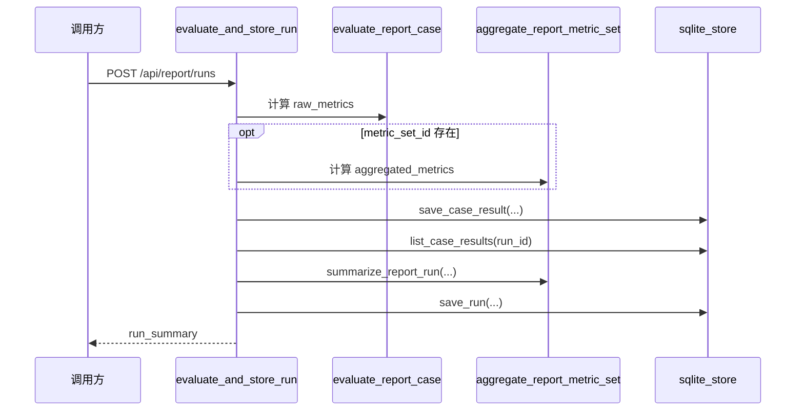

# 后端应用与 API 设计

## 1. 模块定位

后端应用层负责以下职责：

1. 暴露统一的 HTTP API。
2. 在请求入口处完成参数校验、对象装配和错误映射。
3. 在启动阶段初始化 SQLite 库和服务内调度线程。
4. 将前端静态资源挂载到 `/frontend`。

当前入口文件为 `backend/app.py`，未拆出独立的依赖注入容器；对象装配以“请求内即时实例化仓储”为主。

## 2. 应用装配结构

## 3. API 分组

| 分组 | 路由 | 说明 |
| --- | --- | --- |
| 前端与健康检查 | `GET /` `GET /health` | 前端重定向与服务健康检查 |
| 报告样例数据 | `GET /api/report/templates` `GET /api/report/cases` | 返回样例模板与样例用例 JSON |
| 用例集 | `GET /api/case-sets` `GET /api/case-sets/{id}` `GET /api/case-sets/{id}/export` `POST /api/case-sets/{id}/import` | 用例集查询与 Excel 导入导出 |
| 指标管理 | `GET /api/metric-sets` `GET /api/metric-sets/{id}` `POST /api/metric-sets` `PATCH /api/metric-sets/{id}` | 指标集管理 |
| 评测任务 | `POST /api/tasks` `GET /api/tasks` `GET /api/tasks/{id}` `POST /api/tasks/{id}/execute` | 任务配置与手动执行 |
| 执行记录 | `POST /api/runs` `GET /api/runs` `GET /api/runs/{id}` | 兼容入口与执行记录查询 |
| 定时任务 | `POST /api/schedules` `GET /api/schedules` `GET /api/schedules/{id}` `PATCH /api/schedules/{id}` `DELETE /api/schedules/{id}` | 调度规则管理 |
| 报告评测 | `POST /api/report/evaluate` `POST /api/report/runs` `GET /api/report/runs` `GET /api/report/runs/{id}` | 报告评测与结果持久化 |

## 4. 接口层职责边界

| 职责 | 当前实现方式 |
| --- | --- |
| 请求校验 | 在 `app.py` 路由函数中显式检查必填字段 |
| 业务异常映射 | `ValueError -> 400`，`LookupError -> 404` |
| DTO 组装 | 通过 `_task_to_dict`、`_run_to_dict`、`_schedule_to_dict` 等辅助函数完成 |
| 仓储获取 | 路由函数内直接实例化 `Sqlite*Repository` |
| 应用服务调用 | 直接调用 `create_task`、`create_schedule`、`aggregate_report_metric_set` 等函数 |

### 4.1 [边界]

- 当前未引入 Pydantic 请求模型，也未统一抽象 service container。
- 当前路由函数承担了一部分 DTO 组装职责，属于轻量实现。
- 当前错误模型仍较简单，尚未区分业务码与系统码。

## 5. 请求到领域服务的调用链

### 5.1 任务创建链路

### 5.2 报告 run 持久化链路

## 6. 启动初始化设计

### 6.1 启动行为

`startup` 钩子执行以下初始化：

1. `init_db(DEFAULT_META_DB)` 初始化 `report_eval.db`
2. `init_run_db(DEFAULT_RUN_DB)` 初始化 `runs.db`
3. `init_case_set_db(DEFAULT_CASE_SET_DB)` 初始化 `case_sets.db`
4. 创建线程并启动 `_scheduler_loop`

### 6.2 关闭行为

`shutdown` 钩子执行以下清理：

1. 设置 `scheduler_stop_event`
2. 等待调度线程退出，超时 1 秒

### 6.3 [边界]

- 由于仓储构造函数内部也会调用 `init_run_db`，因此任务/调度/指标相关库表具备幂等自初始化能力。
- 调度线程依赖单进程内存状态，不适合多实例共享同一数据库文件的场景。

## 7. API 与代码目录映射

| 路由分组 | 主要 usecase | 主要 repository |
| --- | --- | --- |
| 用例集 | `case_set_usecases.py` | `case_set_repository.py` |
| 任务/执行 | `task_usecases.py` `run_usecases.py` | `run_repository.py` |
| 定时任务 | `schedule_usecases.py` | `run_repository.py` |
| 指标管理 | `metric_set_usecases.py` | `run_repository.py` |
| 报告评测 | `evaluator.py` `report_metric_sets.py` | `sqlite_store.py` `run_repository.py` |

## 8. 非功能设计约束

| 约束 | 当前实现 |
| --- | --- |
| 幂等性 | `init_*` 初始化为幂等；`report_case_result` 以 `(run_id, case_id)` 作为主键覆盖 |
| 并发控制 | 未做显式并发控制；依赖 SQLite 单文件锁 |
| 安全性 | 当前未实现认证鉴权 |
| 可观测性 | 以前端页面和 API 响应为主，未接入日志聚合和指标监控 |
| 可扩展性 | 通过 `core/ports` 为任务/调度/指标保留了仓储替换空间 |

## 9. 后续演进建议

1. 将请求/响应模型从手写 dict 迁移到 Pydantic。
2. 将对象装配从路由内即时创建迁移到依赖注入函数。
3. 为环境配置、用例扩增工具补齐真实后端 API。
4. 为调度线程增加显式运行日志和异常告警。
