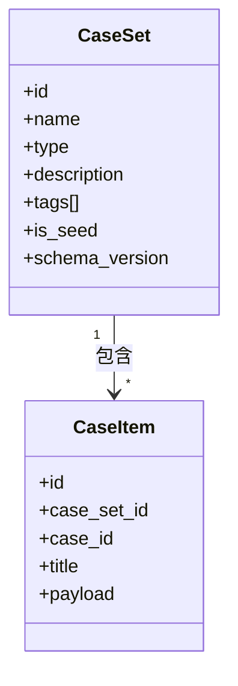
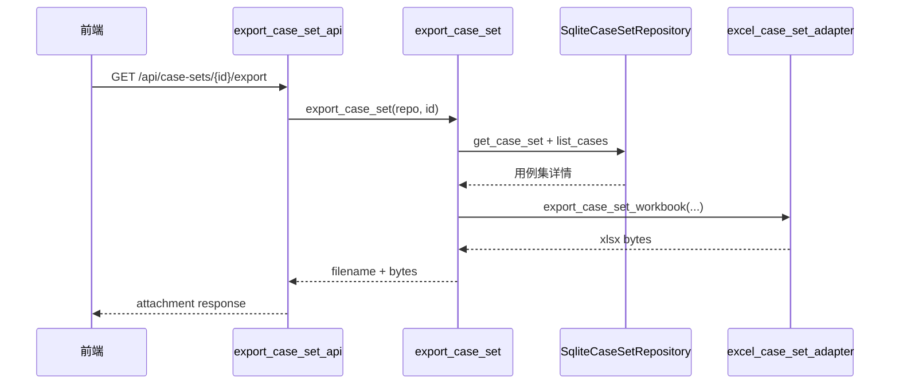
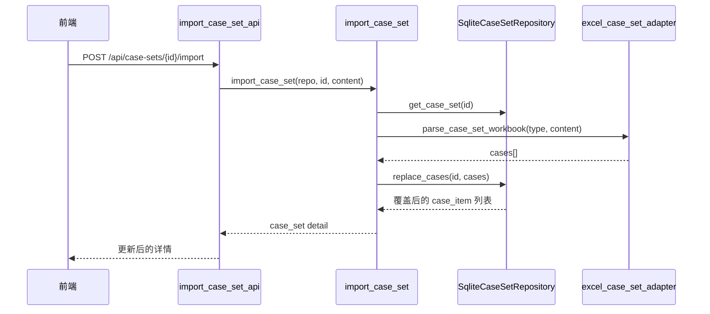

# 用例集与数据管理设计

## 1. 模块定位

用例集管理模块负责管理评测输入资产，当前覆盖以下职责：

1. 用例集列表与详情查询。
2. 通用用例模型与类型扩展 payload 建模。
3. 单个用例集 Excel 导入覆盖。
4. 单个用例集与多选用例集导出 Excel。
5. 种子用例集标识与不可评测约束表达。

当前模块的真实后端能力主要集中在 `GET /api/case-sets`、`GET /api/case-sets/{id}`、`GET /api/case-sets/{id}/export`、`POST /api/case-sets/{id}/import`。

## 2. 领域模型

### 2.1 核心实体

| 实体 | 字段 | 说明 |
| --- | --- | --- |
| `CaseSet` | `id, name, type, description, tags, is_seed, schema_version, created_at, updated_at` | 用例集元信息 |
| `CaseItem` | `id, case_set_id, case_id, title, payload, created_at, updated_at` | 用例实例，`payload` 承载类型扩展字段 |

### 2.2 用例集类型与 payload 约定

| 类型 | 必填字段 | 说明 |
| --- | --- | --- |
| `NL2SQL` | `case_id, question, expected_sql` | 面向结果执行导向的 NL2SQL 用例 |
| `NL2CHART` | `case_id, question, sql, expected_chart_type` | 图表类型与图表生成类用例 |
| `智能问数` | `case_id, question, expected_sql, expected_chart_type` | SQL + 图表联合评测 |
| `报告多轮交互` | `case_id, user_goal, template_name, dialogue_script, param_ground_truth, outline_ground_truth, content_assertions` | 报告生成与多轮交互评测 |

### 2.3 种子用例集

种子用例集通过 `is_seed = true` 标识，当前具有以下语义：

- 主要用于扩增素材，不作为正式评测输入。
- 前端任务创建过滤器中被标记为“种子，不可评测”。
- 当前系统只在页面上提供扩增工具入口，真实后端扩增逻辑尚未实现。

## 3. 存储设计

### 3.1 表结构

| 表 | 主要字段 | 说明 |
| --- | --- | --- |
| `case_set` | `id, name, type, description, tags_json, is_seed, schema_version, created_at, updated_at` | 用例集元数据 |
| `case_item` | `id, case_set_id, case_id, title, payload_json, created_at, updated_at` | 用例内容，`payload_json` 保存类型化字段 |

### 3.2 设计说明

1. `case_item` 使用统一 `payload_json`，避免为不同类型创建不同数据表。
2. `case_id` 是 Excel 模板中的稳定标识；仓储内部 `id` 用于数据库主键。
3. 当前 `case_set_repository.py` 在数据库为空时会自动 seed 一组演示用例集与样例用例。

## 4. Excel 导入导出设计

### 4.1 模板列定义

模板列由 `backend/adapters/excel_case_set_adapter.py` 中的 `TEMPLATE_COLUMNS` 固定定义。

| 类型 | Excel 列 |
| --- | --- |
| `NL2SQL` | `case_id, question, expected_sql` |
| `NL2CHART` | `case_id, question, sql, expected_chart_type` |
| `智能问数` | `case_id, question, expected_sql, expected_chart_type` |
| `报告多轮交互` | `case_id, user_goal, template_name, dialogue_script, param_ground_truth, outline_ground_truth, content_assertions` |

### 4.2 报告类 JSON 字段

以下字段在 Excel 单元格中保存为 JSON 字符串：

- `dialogue_script`
- `param_ground_truth`
- `outline_ground_truth`
- `content_assertions`

导入时系统会执行 `json.loads`，并使用默认空结构进行兜底。

### 4.3 导入校验规则

| 规则 | 行为 |
| --- | --- |
| 列头必须与模板完全一致 | 不一致返回 `400 template mismatch` |
| `case_id` 必填 | 缺失直接报错 |
| `case_id` 文件内唯一 | 重复直接报错 |
| 报告类 JSON 字段必须可解析 | 解析异常直接报错 |

## 5. 核心流程

### 5.1 导出当前用例集

### 5.2 导入覆盖用例集

## 6. 前后端协作关系

| 页面/动作 | 后端接口 | 说明 |
| --- | --- | --- |
| 用例集列表加载 | `GET /api/case-sets` | 实际渲染用例集卡片的真实数据来源 |
| 单个用例集详情 | `GET /api/case-sets/{id}` | 详情页与用例列表数据来源 |
| 多选导出 | 多次调用 `GET /api/case-sets/{id}/export` | 前端进入“导出模式”后逐个触发下载 |
| 更新用例集 | `POST /api/case-sets/{id}/import` | 通过文件选择器上传 Excel 并覆盖原有用例 |

## 7. 当前边界与未实现能力

- 已实现：
  - 用例集查询、详情查询
  - 单个用例集导入覆盖
  - 单个导出与多选导出
- 未实现：
  - 新建用例集
  - 删除用例集
  - 扩增用例集后端逻辑
  - 泛化规则管理后端逻辑
  - 独立的“导入用例”全局入口

## 8. 后续变更同步要求

以下变化发生时，必须同步更新本文档：

1. 用例集类型新增或 payload 列发生变化。
2. Excel 模板列调整。
3. 种子用例集语义变化或扩增工具接入真实后端。
4. 用例集支持新增、删除或版本化能力。
