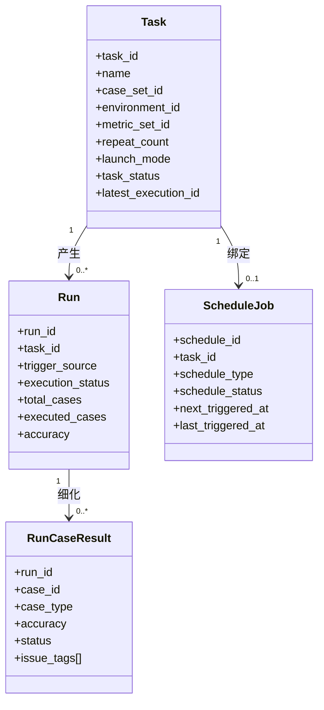
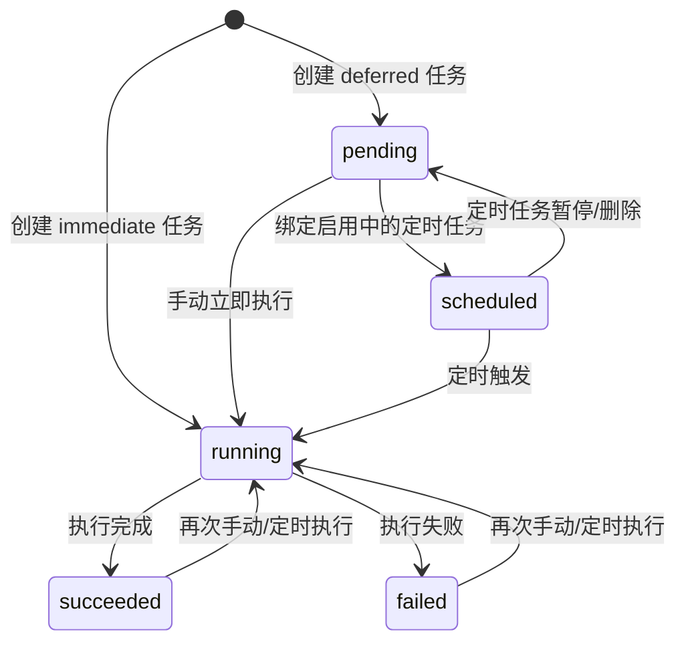
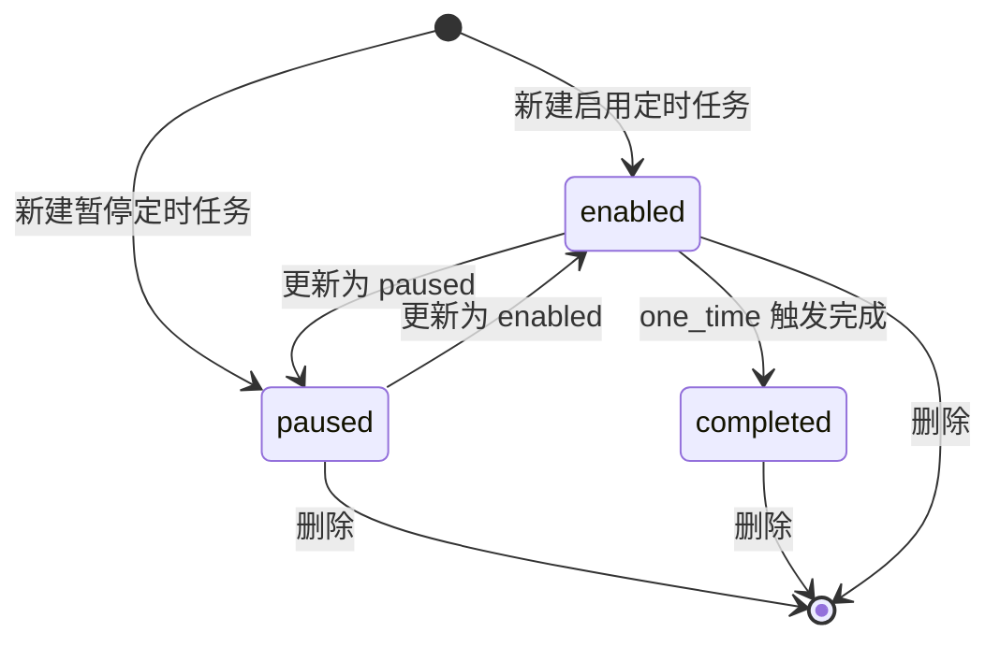
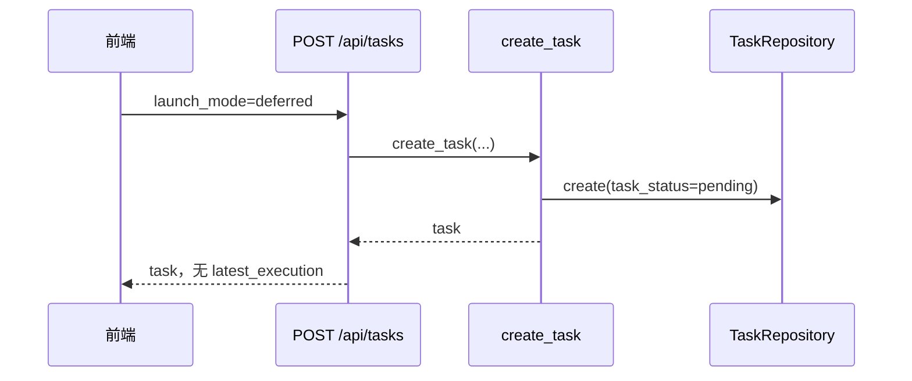
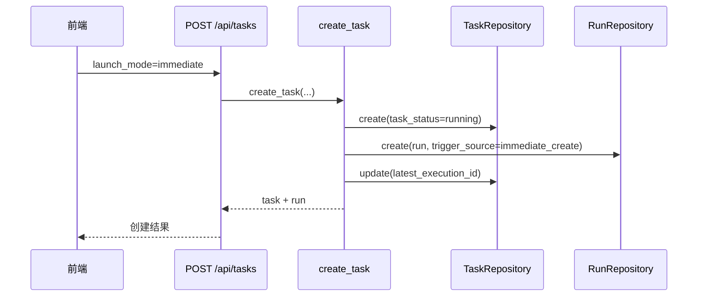

# 评测任务、执行记录与定时调度设计

## 1. 模块定位

该模块负责将“任务配置”和“实际运行”解耦，形成如下三层模型：

1. `Task`：保存评测配置。
2. `Run`：保存每次实际执行记录。
3. `ScheduleJob`：保存定时触发规则。

该设计支持以下业务语义：

- 新建待执行任务，但不立即运行。
- 立即执行任务在创建时生成第一条执行记录。
- 同一任务可被手动或定时多次触发，形成执行历史。

## 2. 领域模型

### 2.1 实体定义

| 实体 | 关键字段 | 说明 |
| --- | --- | --- |
| `Task` | `task_id, case_set_id, environment_id, metric_set_id, repeat_count, launch_mode, task_status, latest_execution_id` | 评测任务配置与最新执行指针 |
| `Run` | `run_id, task_id, total_cases, executed_cases, accuracy, trigger_source, execution_status, started_at, ended_at` | 每次实际执行记录 |
| `RunCaseResult` | `run_id, case_id, case_type, accuracy, status, issue_tags, detail_metrics, summary` | 单次执行内每个用例的明细结果 |
| `ScheduleJob` | `schedule_id, task_id, schedule_type, run_at, daily_time, schedule_status, next_triggered_at, last_triggered_at` | 定时规则 |



### 2.2 枚举与状态

| 分类 | 取值 | 说明 |
| --- | --- | --- |
| `launch_mode` | `immediate`, `deferred` | 创建即执行 / 保存为待执行 |
| `task_status` | `pending`, `scheduled`, `running`, `succeeded`, `failed` | 任务视角状态 |
| `execution_status` | `running`, `succeeded`, `failed` | 单次执行记录状态 |
| `trigger_source` | `immediate_create`, `manual`, `schedule`, `legacy` | 执行来源 |
| `schedule_type` | `one_time`, `daily` | 单次 / 每日 |
| `schedule_status` | `enabled`, `paused`, `completed` | 调度规则状态 |

## 3. 状态机设计

### 3.1 任务状态机



### 3.2 定时任务状态机



## 4. 核心流程

### 4.1 创建待执行任务



### 4.2 创建立即执行任务



### 4.3 定时任务触发

```mermaid
sequenceDiagram
    participant Loop as 调度线程
    participant SRepo as ScheduleRepository
    participant TRepo as TaskRepository
    participant RRepo as RunRepository
    participant TaskUC as execute_task

    Loop->>SRepo: list_due(now)
    loop 每个到期 schedule_job
        Loop->>TaskUC: execute_task(task_id, trigger_source=schedule)
        TaskUC->>TRepo: get(task)
        TaskUC->>RRepo: create(run)
        TaskUC->>TRepo: update(task_status=running, latest_execution_id)
        alt schedule_type = one_time
            Loop->>SRepo: update(completed)
        else schedule_type = daily
            Loop->>SRepo: update(last_triggered_at, next_triggered_at)
        end
    end
```

## 5. 服务内调度器设计

### 5.1 运行方式

- 调度线程在 FastAPI `startup` 时启动。
- `_scheduler_loop` 固定每 30 秒执行一次 `process_due_schedules(DEFAULT_RUN_DB)`。
- `shutdown` 时通过事件对象通知线程退出。

### 5.2 调度规则

| 类型 | 规则 |
| --- | --- |
| `one_time` | `run_at` 到期后触发一次，并转为 `completed` |
| `daily` | 根据 `daily_time` 计算下一次触发时间 |
| 时区 | 默认 `Asia/Shanghai` |
| 绑定约束 | 仅允许绑定 `launch_mode=deferred` 的任务 |
| 唯一性约束 | 同一任务当前仅允许一个激活中的定时任务 |

### 5.3 [边界]

- 当前调度器不支持停机补偿执行。
- 当前调度器不支持分布式多实例选主。
- 当前执行记录默认只创建元数据，不真正下发到外部执行器。

## 6. 执行结果物化与分析

### 6.1 单次执行物化

当前 v1 在任务创建为 `immediate` 或对待执行任务手动/定时触发后，会同步生成：

1. `eval_run` 中的执行记录。
2. `eval_run_case_result` 中的逐用例准确率、状态、问题标签和摘要。
3. `Task.latest_execution_id` 与聚合准确率。

该设计使任务详情页能够直接展示“最近用例执行明细”，并为趋势分析和结果报告导出提供统一数据源。

### 6.2 结果报告导出

任务结果导出不与某一种文件格式绑定，而是通过导出 profile 解耦：

| profile | 格式 | 内容 |
| --- | --- | --- |
| `task-report-excel` | Excel | `任务概览` + `用例明细` 两个页签 |
| `task-report-json` | JSON | 任务、最新执行、用例明细、历史与趋势快照 |

导出流程由 `task_report_usecases.py` 完成，核心步骤如下：

1. 读取任务配置、最新执行和用例执行明细。
2. 汇总最近执行历史，形成趋势快照。
3. 按所选 profile 调用对应 exporter 输出字节流。

### 6.3 趋势分析

趋势分析依赖同一批执行数据，提供三类视角：

- 总览：所有非种子用例集的全局准确率走势与回归告警。
- 用例集：某一用例集的整体准确率趋势、不稳定用例和回归劣化用例。
- 单用例：某一用例在多次执行中的准确率变化、波动率和最近回归。

### 6.4 API 视图补充

| 页面/动作 | 接口 | 说明 |
| --- | --- | --- |
| 导出任务结果报告 | `GET /api/task-report-profiles` | 查询可用导出 profile |
| 导出任务结果报告 | `POST /api/tasks/{id}/export` | 按指定 profile 导出结果文件 |
| 用例集趋势 | `GET /api/case-sets/{id}/trends` | 返回整体准确率趋势与洞察 |
| 用例趋势 | `GET /api/case-sets/{id}/cases/{case_id}/trends` | 返回单用例准确率趋势 |
| 总览趋势分析 | `GET /api/analytics/overview` | 返回全局趋势与回归预警 |

## 7. 存储设计

| 表 | 作用 |
| --- | --- |
| `eval_task` | 保存任务配置 |
| `eval_run` | 保存每次执行记录 |
| `schedule_job` | 保存调度规则 |

### 6.1 关键字段关系

- `eval_task.latest_execution_id -> eval_run.run_id`
- `eval_run.task_id -> eval_task.task_id`
- `schedule_job.task_id -> eval_task.task_id`

## 8. 前后端协作

| 页面/动作 | 接口 | 说明 |
| --- | --- | --- |
| 新增评测 | `POST /api/tasks` | 支持“保存为待执行”和“创建并立即执行” |
| 任务列表 | `GET /api/tasks` | 返回任务基础配置、最新执行摘要、关联定时任务摘要 |
| 任务详情 | `GET /api/tasks/{id}` | 返回执行历史、最新执行、定时任务摘要 |
| 立即执行 | `POST /api/tasks/{id}/execute` | 对待执行任务或已完成任务再次触发 |
| 定时任务列表 | `GET /api/schedules` | 返回调度规则及其绑定任务摘要 |
| 新建定时任务 | `POST /api/schedules` | 绑定待执行任务 |

## 9. 设计收益

1. 将“任务配置”与“运行结果”解耦，避免一个任务只能有一次结果。
2. 能够表达待执行任务、立即执行任务和定时触发任务的差异。
3. 便于在任务详情页聚合多次执行历史。

## 10. 后续变更同步要求

以下变化发生时，必须同步更新本文档：

1. 新增新的触发来源或执行状态。
2. 接入真实执行器，导致 `Run` 生命周期变化。
3. 调度器引入补偿执行、Cron 表达式或分布式部署。
