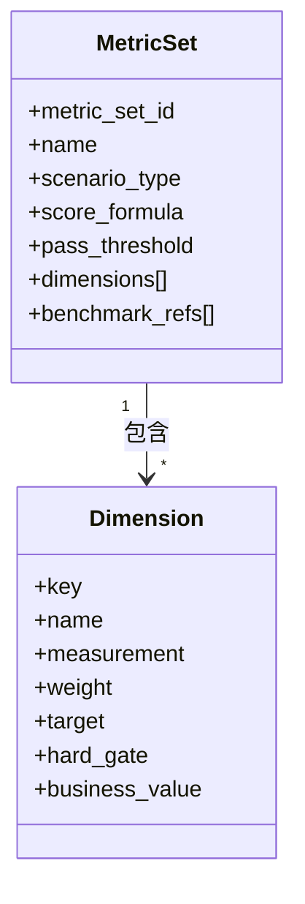
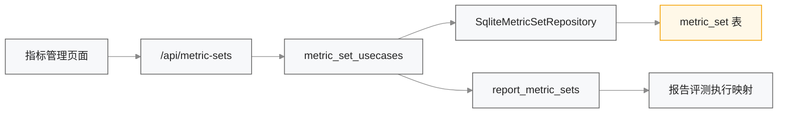

# 指标管理与评测配置设计

## 1. 模块定位

指标管理模块负责定义“评测参数集”，用于描述不同场景下：

1. 评什么维度。
2. 每个维度的权重、阈值和是否硬门禁。
3. 哪些指标只是“配置说明”，哪些已真正接入执行链路。

当前模块的真实后端能力包括：

- 指标集查询、详情、创建、更新。
- 指标集对任务创建的存在性校验。
- 报告多轮交互场景的执行映射与真实聚合评分。

## 2. 指标集模型

### 2.1 `MetricSet` 字段

| 字段 | 含义 |
| --- | --- |
| `metric_set_id` | 指标集标识 |
| `name` | 指标集名称 |
| `scenario_type` | 适用场景，如 `NL2SQL`、`NL2CHART`、`报告多轮交互` |
| `description` | 设计目的与说明 |
| `score_formula` | 当前支持 `weighted_sum`、`weighted_sum_with_gates` |
| `pass_threshold` | 发布门槛 |
| `dimensions` | 指标维度列表 |
| `benchmark_refs` | 外部参考基线列表 |
| `created_at / updated_at` | 时间戳 |

### 2.2 维度结构

每个维度当前固定包含以下字段：

| 字段 | 含义 |
| --- | --- |
| `key` | 机器可识别维度键 |
| `name` | 展示名称 |
| `measurement` | 度量方式说明 |
| `weight` | 权重 |
| `target` | 合格阈值 |
| `hard_gate` | 是否硬门禁 |
| `business_value` | 业务意义 |

## 3. 指标执行状态设计

指标集除了配置本身，还带有执行状态元数据：

- `execution_status.status`: `active | planned`
- `execution_status.supported_dimension_keys`
- `execution_status.unsupported_dimension_keys`
- `execution_mapping[]`

### 3.1 状态语义

| 状态 | 含义 |
| --- | --- |
| `active` | 当前所有维度都已有可执行解析器，并已接入真实执行链路 |
| `planned` | 当前仅完成配置管理，尚未接入真实执行链路 |

### 3.2 当前生效边界

| 场景 | 生效状态 |
| --- | --- |
| `报告多轮交互` | `active` |
| `NL2SQL` | `planned` |
| `NL2CHART` | `planned` |
| `智能问数` | `planned` |
| `通用` | `planned` |

## 4. 预置指标集

当前系统在 `runs.db` 为空时会 seed 一组内置指标集。

| 指标集 ID | 名称 | 场景 |
| --- | --- | --- |
| `metric-default` | ChatBI 通用发布基线 | 通用 |
| `metric-strict` | ChatBI 严格发布门禁 | 通用 |
| `metric-nl2sql-exec` | NL2SQL 执行可靠性 | NL2SQL |
| `metric-nl2chart-fidelity` | NL2CHART 图表保真 | NL2CHART |
| `metric-report-dialogue` | 报告多轮交互生成 | 报告多轮交互 |

## 5. 模块协作设计

### 5.1 与任务模块的关系

- `POST /api/tasks` 和 `POST /api/runs` 在创建任务前会校验 `metric_set_id` 是否存在。
- 任务列表和详情展示的是 `metric_set` 摘要，而不是裸 ID。
- 任务创建弹窗按用例集类型筛选可选指标集。

### 5.2 与报告评测模块的关系

- `metric-report-dialogue` 被允许传入 `/api/report/evaluate` 和 `/api/report/runs`。
- 报告评测模块根据 `dimensions` 计算每个维度的原始值、目标达成情况和总分。

## 6. 报告类指标的执行映射

当前只有 `报告多轮交互` 场景具备固定维度注册表。

| 维度 key | 执行来源 | 公式 |
| --- | --- | --- |
| `template_top1_accuracy` | `template.top1` | `raw.template.top1` |
| `param_slot_f1` | `params.f1` | `raw.params.f1` |
| `task_success_rate` | `completion.completed + delivery.report_generated` | 完成且已生成报告则为 `1.0` |
| `turn_efficiency` | `completion.turns_used` | 成功时按轮次折算为 `0~1` |
| `outline_structure_f1` | `outline.f1` | `raw.outline.f1` |
| `factual_precision` | `content.pass_rate` | `raw.content.pass_rate` |

## 7. API 设计约束

| 接口 | 约束 |
| --- | --- |
| `POST /api/metric-sets` | `scenario_type=报告多轮交互` 时，维度 key 必须在支持集合内 |
| `PATCH /api/metric-sets/{id}` | 更新后同样会重新校验维度 |
| `GET /api/metric-sets` | 返回 `execution_status` 与 `execution_mapping` |
| `GET /api/metric-sets/{id}` | 返回完整维度与执行映射详情 |

## 8. 前端展示设计

指标管理页面当前由三部分组成：

1. 概览卡片：参数集数量、覆盖任务类型、硬门禁总数。
2. 左侧指标集卡片列表：显示场景、门槛、生效状态。
3. 右侧详情面板：显示公式、参考基线、维度表和执行映射表。

### 8.1 当前价值

- 让用户区分“只是配置说明”和“真的参与执行”。
- 明确每个维度来自哪个原始评分值。
- 将评测参数组合从静态文案升级为结构化配置。

## 9. 当前边界

- 只有报告多轮交互指标集处于 `active`。
- `通用`、`NL2SQL`、`NL2CHART`、`智能问数` 当前只做参数集管理，不参与真实评分。
- 指标集的 seed 目前是“空表初始化”，不是 versioned upsert。

## 10. 后续变更同步要求

以下变化发生时，必须同步更新本文档：

1. 新增场景类型或指标维度字段。
2. 指标集 seed 策略改变。
3. `NL2SQL`、`NL2CHART`、`智能问数` 接入真实执行链路。
4. 总分公式或硬门禁规则变化。
