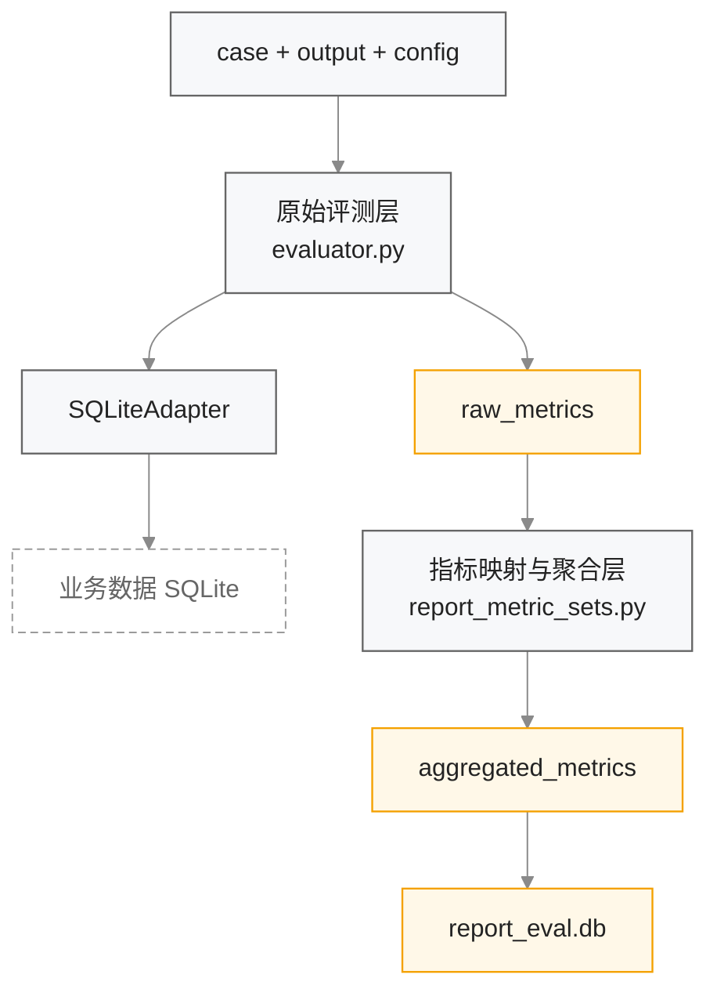
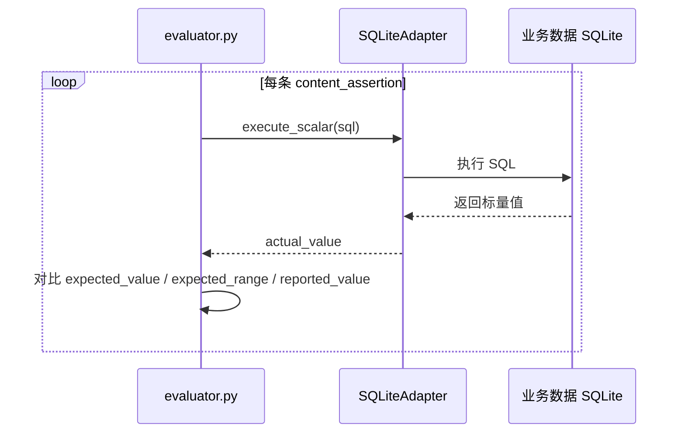

# 报告多轮交互评测引擎设计

## 1. 模块定位

报告评测引擎负责对“报告多轮交互”场景执行结构化评测。当前设计坚持以下原则：

1. 主判分依据是结构化产物和执行断言，而不是 SQL 文本或自然语言相似度。
2. 原始评测与指标聚合分层实现，先产出证据，再映射为业务指标。
3. 报告类指标集只有在具备可执行解析器时才允许进入真实评分链路。

当前核心代码为：

- `backend/core/evaluator.py`
- `backend/core/report_metric_sets.py`
- `backend/adapters/sqlite_adapter.py`
- `backend/storage/sqlite_store.py`

## 2. 评测分层架构

## 3. 原始评测模型

### 3.1 输入结构

| 输入 | 说明 |
| --- | --- |
| `case` | 标准答案，包含模板、参数、大纲、断言等 ground truth |
| `output` | 被测系统产物，包含所选模板、已填参数、缺失参数轨迹、大纲、报告内容等 |
| `config` | 评测配置，默认包含 `n_turns=5`、`topk=3` |
| `data_db_path` | 断言 SQL 运行所依赖的数据库路径 |

### 3.2 原始指标结构

`evaluate_report_case` 当前返回如下结构：

| 一级字段 | 含义 |
| --- | --- |
| `template` | 模板命中分，包含 `top1`、`topk` |
| `params` | 参数填充精确率、召回率、F1 |
| `completion` | 是否在限定轮次内完成、使用轮次 |
| `outline` | 大纲结构精确率、召回率、F1 |
| `content` | 内容断言通过率、失败率、缺失率、错误率 |
| `delivery` | 是否成功生成报告 |
| `overall_score` | 原始平均分，按五个维度等权平均 |

### 3.3 模板兼容逻辑

当前模板字段兼容两套命名：

- 标准答案优先读取 `template_name`，回退 `expected_template_id`
- 被测输出优先读取 `selected_template_name`，回退 `selected_template_id`

## 4. 指标聚合设计

### 4.1 支持的报告维度

| key | 来源 | 说明 |
| --- | --- | --- |
| `template_top1_accuracy` | `raw.template.top1` | 模板是否命中 |
| `param_slot_f1` | `raw.params.f1` | 参数填充准确性 |
| `task_success_rate` | `raw.completion.completed + raw.delivery.report_generated` | 是否在轮次内完成且生成报告 |
| `turn_efficiency` | `raw.completion.turns_used` | 完成前提下按轮次折算效率 |
| `outline_structure_f1` | `raw.outline.f1` | 大纲结构正确性 |
| `factual_precision` | `raw.content.pass_rate` | 内容事实断言通过率 |

### 4.2 聚合公式

当前 `weighted_sum_with_gates` 的执行规则如下：

1. `overall_score = sum(raw_value * weight) / sum(weight)`
2. `target_passed = raw_value >= target`
3. `hard_gate_passed = 所有 hard_gate=true 的维度均满足 target`
4. `threshold_passed = overall_score >= pass_threshold`
5. `passed = hard_gate_passed and threshold_passed`

### 4.3 维度明细输出

聚合结果中，每个维度都会输出：

- `key`
- `name`
- `raw_value`
- `target`
- `weight`
- `hard_gate`
- `target_passed`
- `score_contribution`

## 5. Ground Truth 校验设计

为了避免“缺少标注字段时被动打 0”，当前在报告类指标集进入执行前会进行硬校验。

| 维度 | 必需字段 |
| --- | --- |
| `template_top1_accuracy` | `template_name` 或 `expected_template_id` |
| `param_slot_f1` | `param_ground_truth` |
| `outline_structure_f1` | `outline_ground_truth` |
| `factual_precision` | 非空 `content_assertions` |

如果缺少所需 ground truth，`POST /api/report/evaluate` 和 `POST /api/report/runs` 会返回 `400`。

## 6. 断言执行设计

内容事实评测通过 `SQLiteAdapter` 执行 `content_assertions[].sql` 来完成。

### 6.1 当前价值

- 将内容准确性建立在真实数据执行结果之上。
- 减少 SQL 文本不同但结果等价时的误判。
- 便于后续扩展为更多数据源适配器。

## 7. Run 汇总与持久化设计

### 7.1 持久化结构

| 表 | 说明 |
| --- | --- |
| `report_run` | 保存 run 级配置和汇总指标 |
| `report_case_result` | 保存单 case 的原始指标、聚合指标与输出细节 |

### 7.2 写入策略

1. 每次 `POST /api/report/runs` 先写入单 case 结果。
2. 重新读取该 `run_id` 下的所有 case 结果。
3. 调用 `summarize_report_run` 生成 run 级汇总。
4. 将 `{ raw_summary, aggregated_summary, case_count }` 写回 `report_run.metrics_json`。

### 7.3 汇总逻辑

- `raw_summary`：对各 case 的原始指标做算术平均。
- `aggregated_summary`：对各维度的 `raw_value` 求均值，再重新计算门槛、硬门禁和总分。
- `case_count`：当前 run 下已写入的 case 数量。

## 8. API 设计

| 接口 | 作用 |
| --- | --- |
| `POST /api/report/evaluate` | 单 case 评测，可返回原始或聚合结果 |
| `POST /api/report/runs` | 单 case 评测并写入 run 级结果 |
| `GET /api/report/runs` | 查询报告评测 run 列表 |
| `GET /api/report/runs/{id}` | 查询单个 run 的汇总与 case 结果 |

### 8.1 响应模式

| 条件 | 响应 |
| --- | --- |
| 未传 `metric_set_id` | 返回 `metrics`，即原始指标 |
| 传入合法报告指标集 | 返回 `raw_metrics + applied_metric_set + aggregated_metrics` |
| 传入非报告场景指标集 | 返回 `400` |

## 9. 当前边界

- 当前只有“报告多轮交互”场景接入真实指标聚合。
- 当前断言执行适配器只实现了 SQLite。
- 当前 `overall_score` 同时存在“原始平均分”和“聚合总分”两套语义；前者用于兼容，后者用于真实门禁。

## 10. 后续变更同步要求

以下变化发生时，必须同步更新本文档：

1. 报告类维度注册表变化。
2. `task_success_rate`、`turn_efficiency` 等公式变化。
3. 断言执行适配器支持新的数据源。
4. run 汇总算法或持久化结构发生变化。
