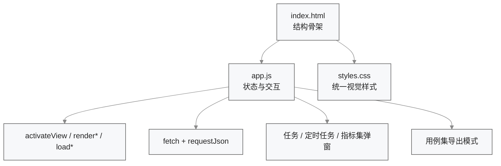
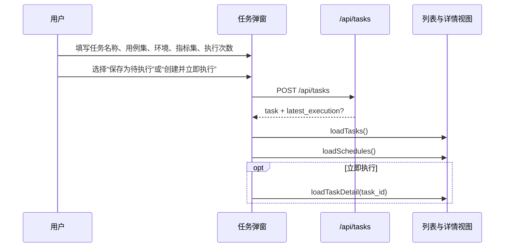
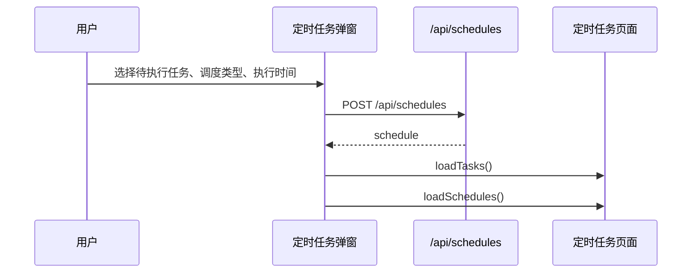
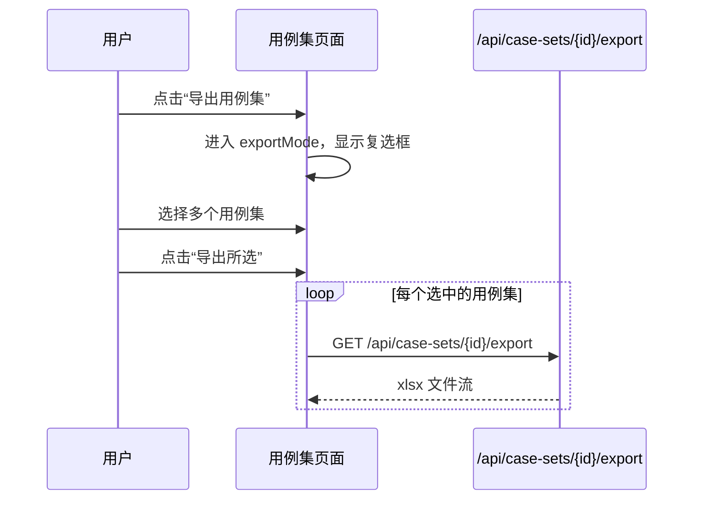
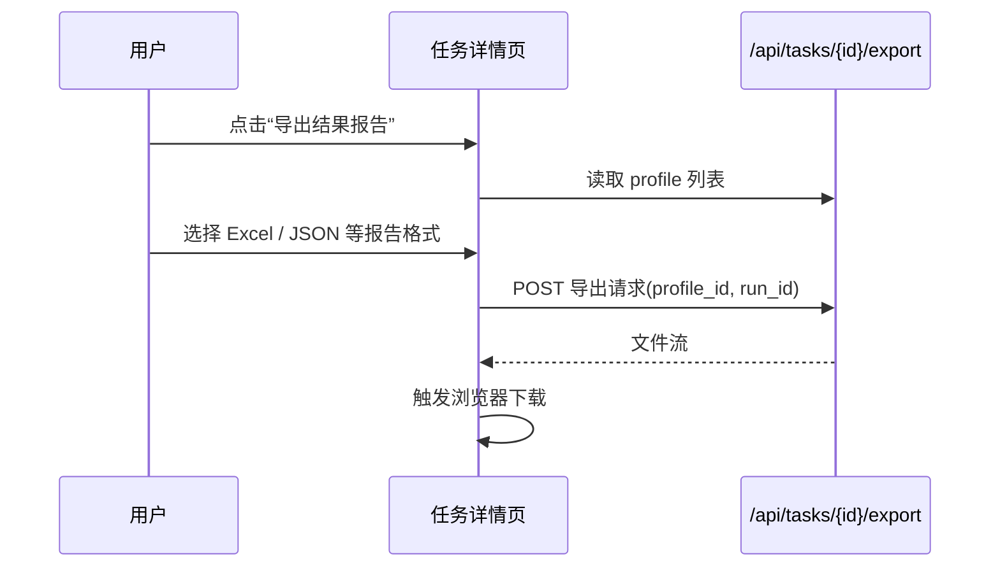

# 前端控制台设计

## 1. 模块定位

前端控制台是当前系统唯一的用户界面，采用 `HTML + CSS + Vanilla JS` 的单页应用形态。其职责包括：

1. 在同一页面内切换一级视图。
2. 调用后端 API 加载任务、定时任务、用例集、指标集等数据。
3. 管理弹窗表单、详情页和导出模式等交互状态。
4. 对真实后端能力和静态占位能力进行统一呈现。

核心文件：

- `frontend/index.html`
- `frontend/app.js`
- `frontend/styles.css`

## 2. 页面信息架构

### 2.1 一级导航

当前侧边栏一级菜单包括：

- `总览`
- `任务列表`
- `定时任务`
- `用例集`
- `环境配置`
- `指标管理`

### 2.2 视图清单

| 视图 | 主要用途 | 当前状态 |
| --- | --- | --- |
| `dashboard` | 总览信息展示 | KPI 为静态占位，趋势分析大屏由真实 API 驱动 |
| `runs` | 评测任务列表 | 真实 API 驱动 |
| `schedules` | 定时任务列表 | 真实 API 驱动 |
| `case-sets` | 用例集卡片页 | 真实 API 驱动，部分工具区静态 |
| `env-config` | 环境配置列表 | 静态占位 |
| `metric-sets` | 指标集管理 | 真实 API 驱动 |
| `case-list` | 单用例集下的用例列表 | 真实 API 驱动 |
| `run-detail` | 任务详情 | 真实 API 驱动，支持结果报告导出与用例执行明细 |
| `case-detail` | 用例详情 | 主要依赖当前用例集详情数据，并叠加单用例趋势 API |

## 3. 前端架构设计

## 4. 状态管理设计

前端未引入框架状态库，当前通过 `app.js` 顶层变量保存页面状态。

| 状态变量 | 含义 |
| --- | --- |
| `tasksState` | 任务列表缓存 |
| `schedulesState` | 定时任务列表缓存 |
| `metricSetsState` | 指标集列表缓存 |
| `currentTaskId` | 当前详情任务 ID |
| `currentCaseSetId` | 当前用例集 ID |
| `currentCaseSetDetail` | 当前用例集详情缓存 |
| `currentMetricSetId` | 当前指标集 ID |
| `taskReportProfilesState` | 结果报告导出 profile 列表缓存 |
| `overviewAnalyticsState` | 总览趋势分析缓存 |
| `exportMode` | 用例集是否处于导出模式 |
| `selectedCaseSetIds` | 导出模式下选中的用例集 |

## 5. 数据加载模式

### 5.1 通用请求封装

`requestJson(url, options)` 负责：

1. 调用 `fetch`
2. 解析 JSON
3. 在 `response.ok = false` 时抛出带 `detail` 的错误

### 5.2 主要加载函数

| 函数 | 后端接口 | 作用 |
| --- | --- | --- |
| `loadTasks()` | `GET /api/tasks` | 加载任务列表并刷新详情候选 |
| `loadTaskDetail(taskId)` | `GET /api/tasks/{id}` | 加载任务详情与执行历史 |
| `loadSchedules()` | `GET /api/schedules` | 加载定时任务列表 |
| `loadMetricSets()` | `GET /api/metric-sets` | 加载指标集并刷新列表与详情 |
| `loadTaskReportProfiles()` | `GET /api/task-report-profiles` | 加载结果报告导出格式 |
| `loadOverviewAnalytics()` | `GET /api/analytics/overview` | 加载总览趋势大屏数据 |
| `loadCaseSetDetail(caseSetId)` | `GET /api/case-sets/{id}` | 加载用例集详情和用例列表 |
| `loadCaseSetTrends(caseSetId)` | `GET /api/case-sets/{id}/trends` | 加载用例集整体趋势与洞察 |
| `loadCaseTrend(caseSetId, caseId)` | `GET /api/case-sets/{id}/cases/{case_id}/trends` | 加载单用例趋势 |

## 6. 关键交互流程

### 6.1 创建评测任务

### 6.2 创建定时任务

### 6.3 用例集导出模式

### 6.4 导出任务结果报告

### 6.5 趋势分析交互

- 总览页展示全局准确率走势、用例集表现卡片和回归劣化预警。
- 用例集页展示整体准确率趋势、不稳定用例和回归劣化用例。
- 用例详情页展示单用例的准确率时间线和趋势洞察。

## 7. 渲染设计

### 7.1 总览大屏

- `renderOverviewAnalytics()` 负责渲染全局准确率折线、用例集表现列表与回归告警。
- 该区域是当前前端中“高阶分析大屏”的最小可用实现。

### 7.2 任务详情

- 除基础配置外，还展示最近用例执行明细。
- 导出结果报告通过独立 modal 完成，报告格式来源于后端 profile 注册表。

### 7.3 用例集与用例趋势

- 用例集页通过 `renderCaseSetTrends()` 渲染整体准确率趋势和洞察列表。
- 用例详情页通过 `renderCaseTrend()` 渲染单用例时间线、波动率与回归提示。

### 7.4 指标管理
### 7.5 任务列表

- 展示任务配置和最新执行摘要。
- 进展列通过 `renderProgressCell()` 输出文本 + 进度条。
- 准确率只显示最近执行记录的百分比值。

### 7.6 指标管理

- 左侧列表展示生效状态和门槛。
- 右侧详情面板展示维度、参考基线和执行映射。
- 编辑弹窗基于当前指标集维度构造表单。

### 7.7 用例集页面

- 默认模式下点击卡片进入详情。
- 导出模式下点击卡片变为选择动作。
- 单用例集详情页支持“更新用例集”和“导出当前用例集”。

## 8. 当前边界

- 环境配置页面为静态占位，尚未接入真实 API。
- 总览页的基础 KPI 仍含静态占位，但趋势分析区已接入真实 API。
- 用例工具中的“扩增用例集”和“泛化规则管理”仍为静态展示。
- 未使用前端框架，状态增多后维护成本会上升。

## 9. 后续变更同步要求

以下变化发生时，必须同步更新本文档：

1. 新增一级视图或详情页。
2. 关键状态变量、数据加载模式或弹窗交互发生变化。
3. 静态占位页面接入真实后端。
4. 前端从 Vanilla JS 迁移到框架化实现。
