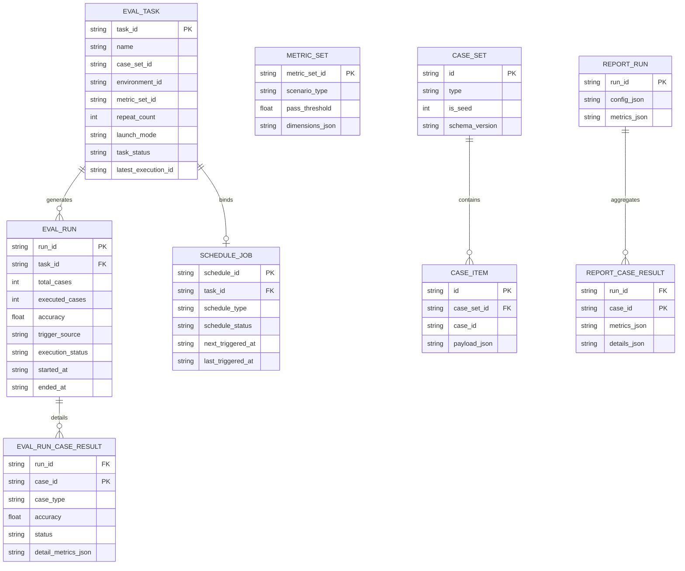
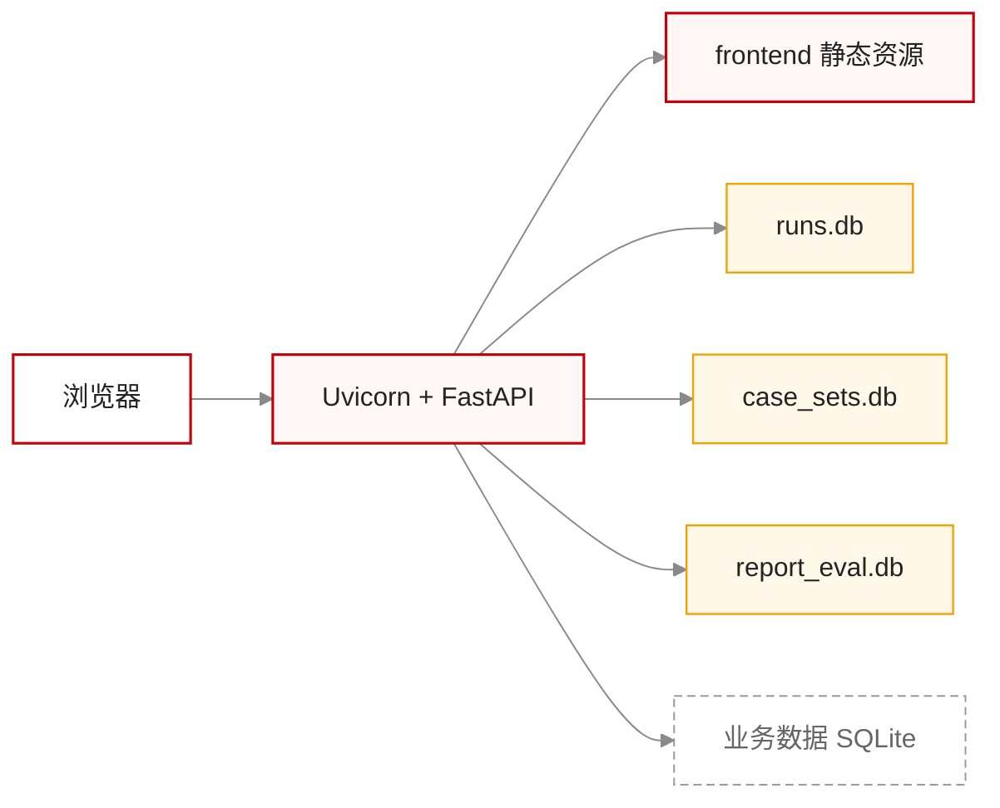
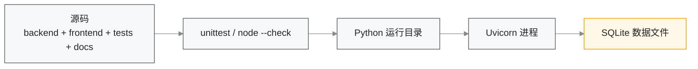

# 数据存储与部署设计

## 1. 模块定位

当前系统采用单体后端 + 多 SQLite 文件的部署形态。本文档回答以下问题：

1. 为什么要将数据拆分到多个 SQLite 文件。
2. 各数据库文件中有哪些表、各自负责什么数据。
3. 当前服务如何部署、有哪些运行边界与风险。
4. 跨机器部署时应如何处理持久化与配置迁移。

## 2. 数据存储拆分策略

当前后端使用三个 SQLite 文件：

| 文件 | 默认路径 | 作用 |
| --- | --- | --- |
| `runs.db` | `backend/runs.db` | 任务、执行记录、逐用例执行结果、定时任务、指标集 |
| `case_sets.db` | `backend/case_sets.db` | 用例集与用例内容 |
| `report_eval.db` | `backend/report_eval.db` | 报告评测 run 与 case 结果 |

### 2.1 拆分原因

1. 用例集导入导出、任务编排、报告评测三类数据更新频率不同。
2. 报告评测结果与运行元数据分离后，表结构演进更独立。
3. 避免所有模块强耦合在单一数据库文件中。

### 2.2 当前代价

- 跨库事务无法统一处理。
- 结果报告导出和趋势分析依赖 `eval_run_case_result`，因此执行记录与逐用例明细需要同步维护。
- 备份和迁移需要同时关注多个文件。
- 默认数据库路径在代码目录下，不利于多机部署和持久化目录隔离。

## 3. 数据模型视图

## 4. 仓储与初始化设计

### 4.1 初始化入口

| 数据库 | 初始化函数 | 文件 |
| --- | --- | --- |
| `runs.db` | `init_run_db()` | `backend/storage/run_repository.py` |
| `case_sets.db` | `init_case_set_db()` | `backend/storage/case_set_repository.py` |
| `report_eval.db` | `init_db()` | `backend/storage/sqlite_store.py` |

### 4.2 Seed 策略

| 模块 | Seed 内容 | 触发条件 |
| --- | --- | --- |
| 用例集 | 演示用例集和样例用例 | `case_set` 为空 |
| 指标集 | 5 组内置指标集 | `metric_set` 为空 |
| 报告评测库 | 无内置业务数据 | 仅创建表 |

### 4.3 幂等性说明

- `create table if not exists` 保证重复初始化安全。
- `runs.db` 中还会通过 `_ensure_column` 对旧库做字段补齐。
- 仓储构造函数内部会调用初始化逻辑，避免只有 startup 路径才能建表。

## 5. 部署视图

### 5.1 运行边界

- 当前服务既提供后端 API，也直接托管前端静态资源。
- 当前调度器与 API 运行在同一进程内。
- 当前未引入 Redis、消息队列或独立 worker。

## 6. 构建与制品视图

### 6.1 说明

当前项目并没有独立的前端构建产物目录，前端静态文件直接以源码形式由 FastAPI 挂载。发布门禁仍以测试通过和服务启动成功为主。

## 7. 跨机器部署建议

### 7.1 当前问题

如果只复制代码而不复制 `.db` 文件，则以下数据不会随代码迁移：

- 自定义指标集
- 环境配置数据（未来接入后）
- 定时任务
- 任务与执行记录
- 导入后的用例集内容

### 7.2 建议方案

1. 将 SQLite 路径改为环境变量配置，不再固定在 `backend/` 目录。
2. 部署时将数据库文件放到独立持久化目录。
3. 为指标集、环境配置、用例集补导出/导入能力，便于跨环境迁移。
4. 正式多用户部署时，逐步迁移到 PostgreSQL。

## 8. 当前风险

- [风险] SQLite 更适合单机、轻并发场景。
- [风险] 服务内调度器不适合多实例部署。
- [风险] `metric_set` 目前采用“空表 seed”策略，内置指标更新无法自动 upsert 到旧环境。
- [风险] 默认数据库文件仍与代码目录耦合。

## 9. 后续变更同步要求

以下变化发生时，必须同步更新本文档：

1. 数据库文件路径策略改变。
2. 数据库类型从 SQLite 切换到其它实现。
3. 新增持久化表或跨库关联策略。
4. 部署形态从单进程扩展到多实例或独立 worker。
